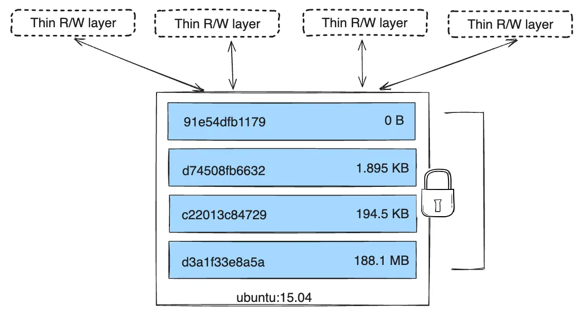

# Image Internals

|||objectives
After this lecture, you should be able to answer the following:
- What is inside a Docker image?
- How do image layers work?
- Why can deleted files still be extracted from an image?
- How do you generate an SBOM for an image?
|||

### What is Inside an Image?

A container image has two parts:

1. A root filesystem (the files, directories, binaries, and libraries).
2. Configuration (metadata like which user to run as, which ports to expose, which command to run).

Dockerfile instructions map to these two parts:

- `FROM`, `COPY`, `RUN`, `ADD` modify the **filesystem**.
- `EXPOSE`, `ENV`, `CMD` modify the **configuration**.

### Image Layers

Each instruction in a Dockerfile that modifies the filesystem creates a new layer. Each layer is only a set of differences from the layer before it.

An image is a stack of layers.

```dockerfile
FROM alpine
RUN apk add curl
COPY app.py /app/
CMD python app.py
```

### The Container Layer

When you run a container, Docker adds one more layer on top: the container layer. This is the only writable layer. Everything below it is read-only.



|||info
You can find more details here: 
https://docs.docker.com/engine/storage/drivers/#images-and-layers
|||


### Inspecting an Image

```bash
sudo docker history myproject-app:latest
```

```bash
sudo docker inspect myproject-app:latest
```

### Exporting and Examining an Image

You can save an image to a tar file and look at its raw contents:

```bash
docker save myproject-app:latest -o mywebapp.tar
mkdir mywebapp-extracted
tar -xf mywebapp.tar -C mywebapp-extracted
ls mywebapp-extracted
```

- manifest.json is the top-level file describing the image. It tells you which file is the configuration, lists the tags, and lists each layer.
- blobs/ is a directory holding the actual data files. Each layer is a tar archive inside here.

You can go further and extract individual layers:

```bash
cd mywebapp-extracted/blobs/sha256
tar -xf <layer-hash> -C /tmp/layer-contents
ls /tmp/layer-contents
```

Every layer is just files.

### The Leaky Image Problem

Let's build an image that has a secret:

```dockerfile
FROM alpine
COPY secret.txt /app/secret.txt
RUN rm /app/secret.txt
CMD echo "nothing to see here"
```

Create the secret:

```bash
echo "password123" > secret.txt
```

Build and run it:

```bash
sudo docker build -t leaky .
sudo docker run leaky
```

The file is "deleted." If you exec into the container, it is not there.

```bash
sudo docker save leaky -o leaky.tar
mkdir leaky-extracted
tar -xf leaky.tar -C leaky-extracted
```

The layer created by `COPY secret.txt` still contains the file. The `RUN rm` command only added a new layer that marks the file as deleted. The original layer with the secret is still there.

What Leaks in Practice?

- Passwords or API keys copied into the image
- `.env` files with database credentials
- SSH private keys
- `.git` directories (contain your entire commit history)
- AWS credentials from `~/.aws`

### Environment Variables Leak Too

Look at this Dockerfile:

```dockerfile
FROM alpine
ENV DB_PASSWORD=secret123
CMD echo "running"
```

Build it and inspect:

```bash
sudo docker build -t env-leak .
sudo docker inspect env-leak"
```

### Generating an SBOM

An SBOM (Software Bill of Materials) is a list of every package and dependency inside your image.

```bash
# install scout plugin
curl -fsSL https://raw.githubusercontent.com/docker/scout-cli/main/install.sh -o install-scout.sh
sudo bash install-scout.sh

sudo docker scout sbom myproject-app:latest
```

It lets you:
- Know exactly what is inside your image.
- Compare two images to see what changed.


|||reading
If you want a CTF related to this lecture, take a look at this one:

https://7rocky.github.io/en/ctf/htb-challenges/forensics/peel-back-the-layers/


You can also check Container Security book by Liz Rice:

https://www.oreilly.com/library/view/container-security/9781492056690/
|||

|||quiz
- What are the two parts of a container image?
- What is the container layer? Why is it different from image layers?
- If you delete a file with `RUN rm`, is it truly gone from the image?
- What is an SBOM?
|||

<div style="text-align: center; font-size: 0.8em; color: gray; margin-top: 50px;">Maysara Alhindi -- 2026</div>